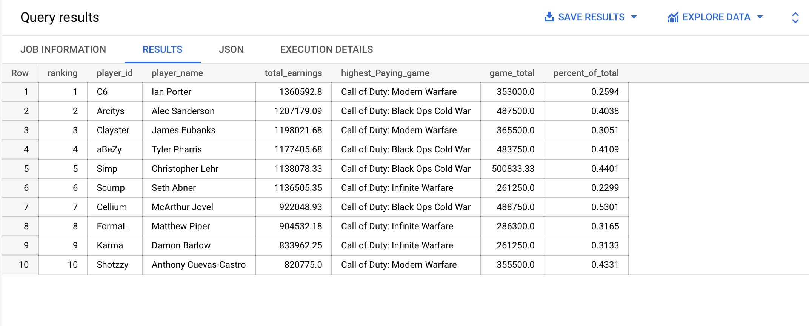
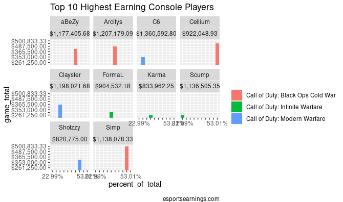

# My Projects By Gonzalo Aguilar

## Descriptive Analysis - Top 10 console players 

#### Project overview 
Analyzing a life-long passion of mine which is gaming! and no better
way to do that by interpreting a dataset I extracted from the web

#### Objectve: Summarize the data and interpret all conclusions 

### Data Collection 

Many tabs later I found the dataset I wanted to work with from a website all about esports and data [HERE](https://www.esportsearnings.com/players/console-players)

I used Google Sheets IMPORTHTML() fuction to import the data into a spreadsheet the field name's are not so pretty to work with in SQL

### Data Altering in BigQuery

in order to visualize and interpret data we import the data into BigQuery and transfrom it to our needs below:

* aliasing column names to visulize and summarize the data easier 
* filtering the data to list only the highest earning(last 30 days) console players 
* Limiting the results to focus only on the top 10 players

ALL SQL QUIERIES [HERE](https://github.com/GonzoReal/Gonzalo_Aguilar_Projects/blob/main/SQL%20QUERIES)

C6,  Arcitys,  Clayster,  Abezy,  Simp, and Scump have all earned more than a milion dollars playing videgames specifcally in Call of Duty,
So the next time you tell your kid to stop playing video games remeber that he/she can have a comfortable living doing the things they enjoy which is gaming

Ian porter known as **C6** in game is the **1# console player by earnings in the last 30 days**
[Tableau viz](https://public.tableau.com/views/Top_10_console_players_16582789242560/Dashboard1?:language=en-US&:display_count=n&:origin=viz_share_link)

should C6 worry about the runner up Alec Sanderson know as Arcitys taking his crown? Looking at the highest paid game and percent of total says otherwise.

### Final Takeaways

Arcitys earned **487,500.00** in his highest payout game contributing to **40%** of his total earnings compared to 

C6 highest payout **353,000.00** contributing to only **25%** of his total earnings 

The #6 rank player Seth Amber know as **Scump** in game, highest payout is **261,000.00** contributing to only **22%** slithering his way to the top of the ranking,  Scump is the player to watch out for next Call of Duty season

The visual speaks in existeince each player's highest payout and much of it contributes to the percent of their total earnings and the one game that top 10 console players are playing is the Call of Duty franchise also my faviorite console game

[R Code Markdown](file:///Users/franciasgaberielacareres/Downloads/Visual_console.html)

### Further Analysis

some players highest payout contributes to most of their total earnings which can lead to questions like are they a one hit wonder or will there winnings be consistent? Only the next Call of Duty game can tell.

 

 

